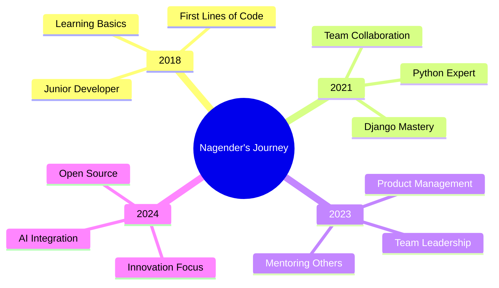

# Creative GitHub README - Nagender Singh Shekhawat


<div align="center">
  
</div>

<div align="center">
  
</div>

## 🎭 About Me - The Human Behind The Code


```yaml
name: "Nagender Singh Shekhawat"
located_in: "Jaipur, Rajasthan 🏰 (The Pink City)"
current_job: "Senior Python Developer @ EdCrawler"
education: ["BCA Graduate", "AI Certified by Great Learning 🤖"]
company: "EdCrawler (GSLC) - Revolutionizing Education 🎓"

fields_of_interests: [
  "Full Stack Development",
  "Team Leadership & Mentoring",
  "EdTech Solutions",
  "AI Integration",
  "Open Source Contribution"
]

technical_background: [
  "Software Developer (6+ years)",
  "Product Manager",
  "Team Leader",
  "Problem Solver Extraordinaire"
]

currently_learning: ["Advanced AI/ML", "Cloud Technologies", "DevOps"]
2024_goals: ["Master AI Integration", "Lead Bigger Teams", "Contribute to OSS"]
hobbies: ["Coding", "Mentoring", "Problem Solving", "Tech Blogging"]
```

<br/>

## 🛠️ My Tech Arsenal - The Tools That Bring Ideas to Life

<div align="center">

### 🚀 Languages & Core Technologies


### 🎨 Frameworks & Libraries


### 🔧 Tools & Platforms


### 📊 Data & Analytics


</div>

<div align="center">
  
</div>

## 🎪 My Coding Journey - From Curious to Creative

<div align="center">
  


</div>

<table align="center">
<tr>
<td align="center" width="25%">

<br><strong>2018-2021</strong>
<br>Building Foundations
</td>
<td align="center" width="25%">

<br><strong>2021-2023</strong>
<br>Mastering Craft
</td>
<td align="center" width="25%">

<br><strong>2023-Present</strong>
<br>Leading & Mentoring
</td>
<td align="center" width="25%">

<br><strong>Future</strong>
<br>Innovation & AI
</td>
</tr>
</table>

## 🎯 What I'm Currently Up To - The Adventure Continues

<div align="center">

| 🔭 **Currently Working On** | 🌱 **Currently Learning** | 👥 **Looking to Collaborate** |
|:---:|:---:|:---:|
|  |  |  |
| EdCrawler Platform | Advanced AI/ML | Open Source Projects |
| Team Leadership | Cloud Technologies | EdTech Solutions |
| Mentoring Developers | DevOps Practices | Innovative Ideas |

</div>

## 🏆 Professional Timeline - My Epic Quest

<div align="center">
  
</div>

<table align="center">
<tr>
<th>🏢 Company</th>
<th>👨‍💼 Role</th>
<th>📅 Duration</th>
<th>🚀 Key Achievements</th>
</tr>
<tr>
<td> EdCrawler (GSLC)</td>
<td>Senior Python Developer</td>
<td>2023 - Present</td>
<td>Leading EdTech Revolution 🎓</td>
</tr>
<tr>
<td> Auratech Services</td>
<td>Python/Django Developer</td>
<td>2021 - 2022</td>
<td>Full-Stack Mastery 💻</td>
</tr>
<tr>
<td> Lakshika Solutions</td>
<td>Python/Django Developer</td>
<td>2018 - 2021</td>
<td>Foundation Building 🏗️</td>
</tr>
</table>

## 📊 GitHub Stats - The Numbers That Tell My Story

<div align="center">
  
  
</div>

<div align="center">
  
</div>

<div align="center">
  
</div>

## 🌟 Featured Projects - My Digital Creations

<div align="center">

### 🎓 EdCrawler - Transforming Education


**The Challenge:** Making education accessible and simplifying school admissions  
**My Role:** Senior Developer & Team Leader  
**Tech Magic:** Django, MySQL, Bootstrap, AJAX, jQuery, REST APIs  
**Impact:** Helping thousands of families find the perfect education match! 

---

### 🍎 FruitChaat - Fresh & Digital


**The Vision:** Bringing fresh groceries to your doorstep  
**My Role:** Senior Django Developer  
**Tech Stack:** Django, MySQL, Bootstrap, JavaScript  
**Result:** Seamless e-commerce experience for fresh produce 

---

### 🌍 Climate Solutions - For Our Planet


**The Mission:** Raising climate awareness and promoting sustainability  
**My Role:** Django Developer  
**Technologies:** Django, MySQL, Bootstrap, AJAX  
**Goal:** Making the world more environmentally conscious 

</div>

## 🎨 My Coding Philosophy - The Art of Problem Solving

<div align="center">
  
</div>

<table align="center">
<tr>
<td align="center" width="33%">

<br><strong>Clean Code</strong>
<br><em>"Code is poetry written for machines and humans"</em>
</td>
<td align="center" width="33%">

<br><strong>Team First</strong>
<br><em>"Great software is built by great teams"</em>
</td>
<td align="center" width="33%">

<br><strong>Never Stop Learning</strong>
<br><em>"Stay curious, stay humble, stay coding"</em>
</td>
</tr>
</table>

## 🎪 Fun Facts About Me - The Person Behind The Pixels

<div align="center">

| 🏠 **Based In** | 🎯 **Superpower** | ☕ **Fuel** | 🎵 **Coding Playlist** |
|:---:|:---:|:---:|:---:|
| <br>Jaipur (Pink City) | <br>Turning Coffee into Code | <br>Chai & Coffee ☕ | <br>Lo-fi Hip Hop 🎶 |

</div>

```python
class NagenderSingh:
    def __init__(self):
        self.name = "Nagender Singh Shekhawat"
        self.pronouns = ["He", "Him"]
        self.location = "Jaipur, Rajasthan 🏰"
        self.languages_spoken = ["हिंदी", "English", "Python", "JavaScript"]
        self.current_status = "Building the future of EdTech"
        self.fun_fact = "I debug with rubber ducks and chai! ☕🦆"
        
    def say_hi(self):
        return """
        🙏 Namaste! Thanks for visiting my profile!
        
        I'm not just a developer - I'm a digital craftsman who believes 
        in creating code that doesn't just work, but makes people's 
        lives better. Whether it's helping students find their perfect 
        school or mentoring the next generation of developers, I'm 
        passionate about using technology to solve real problems.
        
        Let's connect and build something amazing together! 🚀
        """
        
developer = NagenderSingh()
print(developer.say_hi())
```

## 🎯 Let's Connect - The Network Effect

<div align="center">
  <h3>🤝 Ready to collaborate? Let's make magic happen!</h3>
  
  <a href="https://www.linkedin.com/in/nagender1999/">
    
  </a>
  
  <a href="mailto:nagendersingh301024@gmail.com">
    
  </a>
  
  <a href="https://github.com/nagsaa">
    
  </a>
  
</div>

<div align="center">
   
  <br>
  <em><b>I love connecting with fellow developers, dreamers, and digital creators!</b></em>
  <br>
  <em>If you want to chat about tech, share ideas, or just say hi - I'm always up for a good conversation! 😊</em>
</div>

## 📈 Profile Analytics - The Data Behind The Developer

<div align="center">
  
  
  
</div>

<div align="center">
  
</div>

## 🎊 Thank You For Stopping By!

<div align="center">
  
  
  ### 🚀 Ready to build the future together?
  
  
  
  *"Code is like humor. When you have to explain it, it's bad." - Cory House*
  
  ---
  
  **⭐ If you found my profile interesting, don't forget to star some repositories!**
  
  **🔔 Follow me for updates on my coding adventures!**
  
</div>

<div align="center">
  
</div>
```
